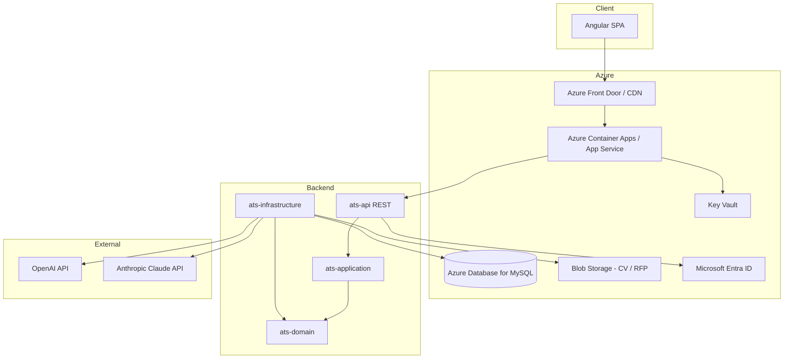

# Plan d'architecture — ESN ATS/CRM

> Document de référence pour le développement pas à pas.  
> Stack : **Java 21 · Spring Boot 3.4 · Angular 19 · MySQL 8 · Azure · OpenAI / Claude**

---

## 1. Vision produit

### 1.1 Objectif

Plateforme interne **ATS** (Applicant Tracking System) et **CRM** orientée **ESN**, pour accélérer les activités **Sales** et **RH** :

| Domaine | Capacités cibles |
|---------|------------------|
| **Sourcing** | Recherche candidats, import CV, enrichissement profils |
| **Matching / Scoring IA** | Rapprochement besoin ↔ profil, score explicable |
| **RFP / AO** | Parsing appels d'offres, génération de réponses assistées |
| **Candidatures** | Pipeline RH, statuts, historique, notifications |
| **CRM** | Comptes clients, contacts, opportunités commerciales |

### 1.2 Personas

- **Commercial** : opportunités, clients, RFP, matching rapide pour proposer des profils
- **Recruteur / RH** : candidats, candidatures, sourcing, scoring
- **Manager** : tableaux de bord, KPIs, validation
- **Admin** : référentiels, droits, paramétrage IA

### 1.3 Principes directeurs

- **Modularité** : bounded contexts métier (candidat, client, opportunité, matching, RFP, sourcing)
- **API-first** : contrats REST versionnés, OpenAPI
- **IA assistée, pas autonome** : toute suggestion IA est traçable, révisable, validable par l'humain
- **Sécurité by design** : RBAC, audit trail, secrets hors code
- **Évolutivité Azure** : conteneurs, managed MySQL, Key Vault, Entra ID

---

## 2. Architecture technique

### 2.1 Vue d'ensemble



### 2.2 Backend — architecture hexagonale (ports & adapters)

| Module Maven | Rôle |
|--------------|------|
| `ats-common` | Exceptions métier, utilitaires, constantes |
| `ats-domain` | Entités, value objects, **ports** (interfaces repository / services externes) |
| `ats-application` | Cas d'usage, orchestration, DTOs applicatifs |
| `ats-infrastructure` | JPA, Flyway, clients HTTP IA, adapters Azure |
| `ats-api` | Controllers REST, sécurité, configuration Spring Boot |

**Règle de dépendance** : `api → infrastructure → application → domain → common`  
Le domaine ne dépend d'aucun framework.

### 2.3 Frontend — architecture par features

| Dossier | Rôle |
|---------|------|
| `core/` | Services singleton (API, auth), interceptors, guards, modèles transverses |
| `shared/` | Composants UI réutilisables (tables, badges statut, upload fichier) |
| `layout/` | Shell applicatif (sidebar, header, layouts auth / main) |
| `features/` | Modules métier lazy-loaded (candidates, matching, rfp, etc.) |

**Alias TypeScript** : `@core/*`, `@shared/*`, `@features/*`, `@env/*`

### 2.4 Modèle de données (aperçu — à détailler en phase 2)

Entités principales prévues :

- `Account`, `Contact` (CRM)
- `Opportunity` (besoin client / mission)
- `Candidate`, `CandidateSkill`, `ResumeDocument`
- `Application` (candidature liée à une opportunité)
- `MatchScore` (résultat scoring IA + justification)
- `RfpDocument`, `RfpResponse` (AO / réponses)
- `SourcingCampaign`, `SourcingResult`
- `AuditRevision` (traçabilité — déjà amorcé en V1 Flyway)

Relations clés : `Opportunity` ↔ `Application` ↔ `Candidate` ; `MatchScore` lié à `Opportunity` + `Candidate`.

---

## 3. Arborescence des dossiers

### 3.1 Racine du monorepo

```
/
├── architecture_plan.md      # Ce document
├── docker-compose.yml        # MySQL local
├── .env.example              # Variables d'environnement
├── .gitignore
├── backend/                  # Maven multi-modules
├── frontend/                 # Angular SPA
├── infra/
│   ├── mysql/init/           # Scripts init Docker
│   └── azure/                # Bicep / Terraform (phase 6)
└── docs/                     # ADR, diagrammes (optionnel)
```

### 3.2 Backend (`backend/`)

```
backend/
├── pom.xml                         # Parent ats-platform
├── ats-common/
│   └── src/main/java/.../common/{exception,util,constants}/
├── ats-domain/
│   └── src/main/java/.../domain/
│       ├── ai/{dto,port}/
│       ├── candidate/{model,port}/
│       ├── client/{model,port}/
│       ├── opportunity/{model,port}/
│       ├── application/{model,port}/
│       ├── matching/{model,port}/
│       ├── rfp/{model,port}/
│       ├── sourcing/{model,port}/
│       └── shared/
├── ats-application/
│   └── src/main/java/.../application/
│       ├── candidate|client|opportunity|application|matching|rfp|sourcing/
│       └── shared/dto/
├── ats-infrastructure/
│   └── src/main/java/.../infrastructure/
│       ├── persistence/{entity,repository,adapter}/
│       ├── ai/openai/{OpenAiAdapter, prompts, props}/
│       ├── config/
│       └── security/
│   └── src/main/resources/db/migration/   # Flyway V1, V2...
└── ats-api/
    └── src/main/java/.../ats/
        ├── AtsApplication.java
        └── api/
            ├── config/
            ├── controller/{candidate,client,opportunity,application,matching,rfp,sourcing}/
            ├── security/
            └── mapper/
    └── src/main/resources/
        ├── application.yml
        └── application-dev.yml
```

### 3.3 Frontend (`frontend/`)

```
frontend/
├── angular.json
├── package.json
├── proxy.conf.json                 # Proxy /api → backend local
├── tsconfig.json
└── src/
    ├── index.html
    ├── main.ts
    ├── styles.scss
    ├── environments/
    │   ├── environment.ts
    │   └── environment.prod.ts
    ├── assets/{i18n,images}/
    └── app/
        ├── app.component.ts
        ├── app.config.ts
        ├── app.routes.ts
        ├── core/
        │   ├── guards/
        │   ├── interceptors/
        │   ├── services/
        │   └── models/
        ├── shared/
        │   ├── components/
        │   ├── pipes/
        │   ├── directives/
        │   └── ui/
        │       └── pagination-bar/
        ├── layout/
        │   ├── main-layout/
        │   └── auth-layout/
        └── features/
            ├── auth/login/
            ├── dashboard/
            ├── candidates/{list,form}/
            ├── clients/{list,form}/
            ├── opportunities/{list,form}/
            ├── applications/
            ├── matching/
            ├── rfp/
            └── sourcing/
```

---

## 4. Intégrations IA

### 4.1 Cas d'usage

| Cas | Provider suggéré | Sortie attendue |
|-----|----------------|-----------------|
| Parsing CV (PDF/DOCX → JSON structuré) | OpenAI ou Claude | Profil structuré + compétences |
| Matching besoin ↔ candidat | OpenAI ou Claude | Score 0–100 + justification |
| Analyse RFP | Claude (long contexte) | Exigences extraites, checklist |
| Brouillon réponse RFP | OpenAI / Claude | Sections éditables par le commercial |

### 4.2 Design technique

- Interface `AiProvider` dans `domain` (port)
- Implémentations `OpenAiClient`, `ClaudeClient` dans `infrastructure`
- **Prompts versionnés** dans `infrastructure/ai/prompt/` (fichiers templates)
- Journalisation : `prompt_hash`, `model`, `tokens`, `latency`, `user_id` (table dédiée phase 4)
- **Fallback** : provider secondaire si timeout / erreur 5xx
- Clés API uniquement via variables d'environnement / Azure Key Vault

### 4.3 Garde-fous

- Pas d'envoi de données personnelles sans politique RGPD validée
- Anonymisation optionnelle avant appel IA (phase 4)
- Limite de débit (rate limiting) côté application

---

## 5. Sécurité & conformité

| Sujet | Approche |
|-------|----------|
| Authentification | Microsoft Entra ID (OAuth2 / OIDC) — Azure AD du groupe |
| Autorisation | RBAC : `ROLE_SALES`, `ROLE_HR`, `ROLE_MANAGER`, `ROLE_ADMIN` |
| API | JWT Bearer, validation côté `ats-api` |
| Données | Chiffrement au repos (Azure MySQL), TLS en transit |
| Audit | Table `audit_revision` + extension par entité |
| Fichiers | Blob Storage avec SAS URLs courte durée |

---

## 6. Roadmap par phases

### Phase 0 — Fondations ✅ (actuelle)

- [x] Arborescence monorepo
- [x] Parent Maven + modules
- [x] Squelette Angular + proxy API
- [x] Docker MySQL + Flyway V1
- [x] Ce document d'architecture

**Livrable** : `mvn compile` et structure prête pour le développement.

---

### Phase 1 — Socle technique (2–3 semaines)

**Backend**
- [x] Schéma Flyway V2 : utilisateurs, rôles (`ROLE_CLIENT`, `ROLE_AGENT`, `ROLE_ADMIN`)
- [x] JWT dev (`app.security.auth-mode=jwt-local`) + `SecurityFilterChain` + `@PreAuthorize`
- [x] Bascule **OAuth2 Resource Server** (`app.security.auth-mode=oauth2-resource-server`, profils `prod` / `azure`) — validation JWT **Microsoft Entra ID** (`issuer-uri`) + mapping `roles` / `scp` / groupes → `ROLE_AGENT` / `ROLE_ADMIN` / `ROLE_CLIENT`
- [x] Exception handler global + format d'erreur API standard (ProblemDetail)
- [ ] OpenAPI complet + exemples

**Frontend**
- [x] Layout principal (sidebar, navigation par rôle)
- [x] `AuthService` + `tokenInterceptor` (Bearer async) + guards auth / rôles
- [x] Page login JWT dev ou **Microsoft SSO (MSAL)** selon environnement Angular (`environment.prod.ts`)
- [ ] Design system minimal (tokens SCSS, composants shared)

**Infra locale**
- [ ] Scripts `make` ou documentation démarrage : `docker compose up`, `mvn spring-boot:run`, `npm start`

**Critères d'acceptation** : un utilisateur authentifié accède au dashboard vide sécurisé ; en production/Azure, SSO Entra avec jetons émis pour l’API et rôles mappés côté resource server sans casser les `@PreAuthorize` existants.

### Option C (industrialisation Azure / Entra) — complété

**Backend**

- [x] `spring-boot-starter-oauth2-resource-server` + `application-prod.yml` (issuer Entra, datasource MySQL Azure, placeholders)
- [x] `JwtAuthenticationConverter` personnalisé (`EntraJwtGrantedAuthoritiesConverter`) + YAML `app.security.entra.*`
- [x] Bascule réversible **`app.security.auth-mode`** (`jwt-local` défaut ou `SECURITY_AUTH_MODE` / fichier `prod`)
- [x] Groupe Spring `spring.profiles.group.azure → prod`

**Frontend**

- [x] `@azure/msal-browser`, `@azure/msal-angular` + `TOKEN_BEARER` (JWT local ou MSAL silent) avec `tokenInterceptor`

**Infrastructure / déploiement**

- [ ] IaC Azure (MySQL Flexible, Container Apps, Key Vault, app registrations, DNS) — pilotage hors code

---

### Phase 2 — CRM & référentiels (2–3 semaines)

- [x] CRUD `Candidate` et `Client` (comptes entreprise)
- [x] Migration Flyway V3 + adapters JPA
- [x] API `/v1/agent/candidates` et `/v1/agent/clients`
- [x] Listes Angular candidats / clients
- [x] CRUD `Opportunity` + migration V4 + association client (`client_id`)
- [x] API `/v1/agent/opportunities` + liste Angular
- [x] Formulaires Angular création / édition (candidat, client, opportunité + select client via `ClientApiService`)
- [x] Pagination & recherche côté **client** (compétences / secteur) — prêt pour bascule Spring Data `Pageable` côté API
- [ ] Filtres, pagination, tri **côté API** (Spring Data)
- [ ] Écran détail « fiche » (hors formulaire) — optionnel
- [ ] Tests d'intégration repository + tests API MockMvc

**Critères d'acceptation** : un agent crée et modifie candidats, clients et opportunités depuis l’UI ; listes paginées et filtrées localement.

---

### Phase 3 — Candidats & candidatures (3–4 semaines)

- [ ] CRUD `Candidate`, statuts `Application`
- [ ] Upload CV → Blob Storage
- [ ] Pipeline kanban des candidatures
- [ ] Recherche full-text (MySQL FULLTEXT ou Elasticsearch — décision ADR)

**Critères d'acceptation** : un recruteur gère le cycle complet d'une candidature sur une opportunité.

---

### Phase 4 — IA : parsing CV & matching / scoring

- [x] Port domaine `AiService` avec `CandidateProfileDto` et `MatchingResultDto`
- [x] `OpenAiAdapter` : Structured Outputs (`json_schema` strict) pour parsing CV + matching/scoring
- [x] `MatchingApplicationService` : orchestration repos + IA (`parseCv`, `scoreCandidateAgainstOpportunity`)
- [ ] Adaptateur secondaire Claude + sélection selon configuration
- [x] `POST /v1/agent/matching` (corps `{ candidateId, opportunityId }` → score + `strengths[]` / `weaknesses[]`)
- [x] `POST /v1/agent/candidates/upload` (`multipart`, champ `file` : PDF/texte → Tika → IA → candidat créé avec `cv_content`)
- [ ] Matching multi-candidats (batch) depuis une opportunité
- [ ] Persistance audit `ai_request_log`
- [x] UI : fiches opportunité & candidat, jauge score IA, analyse points forts / points d’attention, **drag & drop import CV (Option B)**

**Critères d’acceptation (Phase IA exposition)** : un agent obtient depuis l’UI un score IA et une analyse structurée pour une paire candidat–opportunité ; peut importer un fichier CV pour création automatique d’un candidat.

---

### Phase 5 — RFP / Appels d'offres (3 semaines)

- [ ] Upload RFP, extraction exigences (IA)
- [ ] Assistant rédaction réponse (brouillon éditable)
- [ ] Historique versions réponse
- [ ] Workflow validation manager

**Critères d'acceptation** : import d'un PDF RFP et génération d'un brouillon de réponse modifiable.

---

### Phase 6 — Sourcing & Azure production (3–4 semaines)

- [ ] Campagnes sourcing, critères, résultats
- [ ] IaC Azure : MySQL Flexible Server, Container Apps, Key Vault, Blob, Entra app registration
- [ ] CI/CD : GitHub Actions ou Azure DevOps (build, test, deploy)
- [ ] Monitoring : Application Insights, alertes

**Critères d'acceptation** : déploiement staging Azure avec smoke tests automatisés.

---

### Phase 7 — Optimisation & industrialisation (continu)

- [ ] Cache (Redis) pour recherches fréquentes
- [ ] Notifications (email / Teams)
- [ ] Exports Excel / PDF
- [ ] Tableaux de bord KPI (fill rate, time-to-submit, etc.)
- [ ] Revue performance & charges IA

---

## 7. Conventions de développement

### 7.1 Backend

- Packages : `com.esn.ats.{module}.{feature}`
- REST : `/api/v1/{resource}` — pluriel, kebab-case
- DTOs suffixés `Request` / `Response` ; mappers MapStruct
- Transactions au niveau `application` (`@Transactional` sur services)
- Migrations Flyway : `V{n}__description_snake.sql` — jamais modifier une migration appliquée

### 7.2 Frontend

- Composants standalone, suffixe `.component.ts`
- Smart / dumb : containers dans `features/`, UI pure dans `shared/`
- Services API : un service par ressource REST
- State : signals Angular (éviter NgRx sauf besoin fort)

### 7.3 Git & qualité

- Branches : `main`, `develop`, `feature/*`, `fix/*`
- Commits : Conventional Commits (`feat:`, `fix:`, `chore:`)
- PR obligatoire, 1 review minimum
- Couverture tests cible : 70 % backend services critiques, tests composants clés frontend

---

## 8. Démarrage local

### Prérequis

- JDK 21, Maven 3.9+
- Node.js 20 LTS, npm 10+
- Docker & Docker Compose

### Commandes

```bash
# 1. Base de données
docker compose up -d

# 2. Variables (copier et adapter)
cp .env.example .env   # chargé automatiquement par Spring (spring.config.import)

# 3. Backend
cd backend && mvn -pl ats-api -am spring-boot:run -Dspring-boot.run.profiles=dev

# 4. Frontend
cd frontend && npm install && npm start
```

- API : http://localhost:8080/api  
- Swagger : http://localhost:8080/api/swagger-ui.html  
- UI : http://localhost:4200  

---

## 9. Décisions d'architecture (ADR à rédiger)

| # | Sujet | Options | Décision |
|---|-------|---------|----------|
| ADR-001 | Auth | Basic vs Entra ID | **Entra ID** (phase 1) |
| ADR-002 | Recherche candidats | MySQL FULLTEXT vs Elasticsearch | À trancher phase 3 |
| ADR-003 | Stockage fichiers | Blob local vs Azure Blob | **Azure Blob** en prod |
| ADR-004 | Provider IA par défaut | OpenAI vs Claude | **OpenAI** matching, **Claude** RFP longs |
| ADR-005 | Déploiement | App Service vs Container Apps | À trancher phase 6 |

---

## 10. Prochaine action immédiate

**Démarrer la Phase 1** : implémenter le schéma utilisateurs/rôles (Flyway V2), brancher Entra ID, et construire le layout Angular avec navigation sécurisée.

> Valider ce plan avec les parties prenantes Sales/RH/IT avant d'engager le développement des phases 4–5 (budget tokens IA, RGPD).

---

*Dernière mise à jour : mai 2026 — version 0.1.0*
